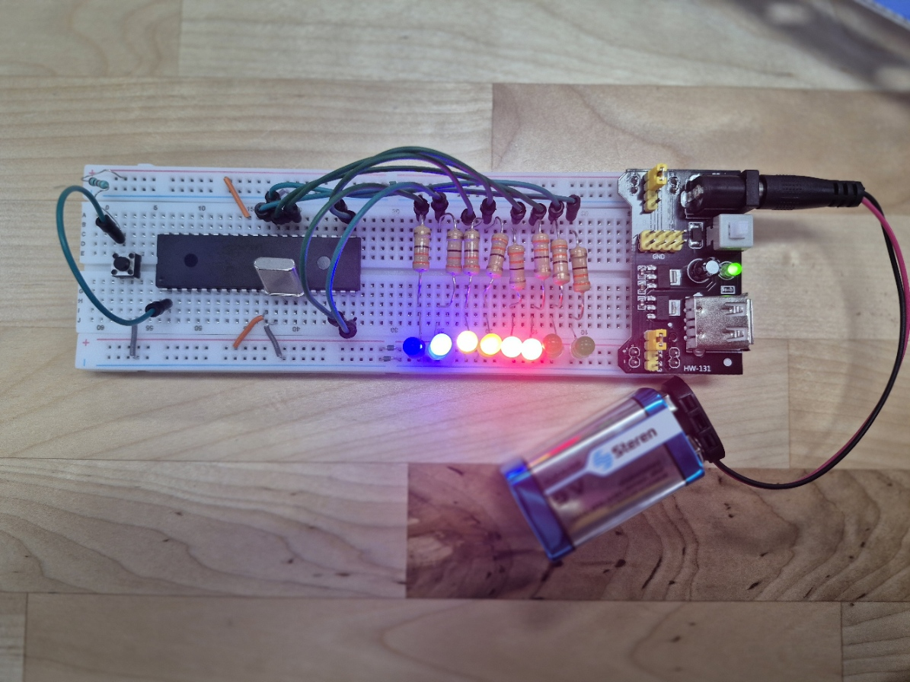

# Práctica 01 - Salidas Digitales

Proyecto desarrollado con el microcontrolador **PIC16F887** utilizando **MPLAB X IDE**, compilador **XC8** y simulación en **Proteus**.

## Descripción General

En esta práctica se trabajó con el manejo de salidas digitales del microcontrolador **PIC16F887**. Se realizaron dos actividades principales: una caminata de LEDs y un contador binario de 6 bits.

La primera actividad consistió en encender LEDs de forma secuencial para generar un efecto de desplazamiento o “caminata”. La segunda actividad consistió en representar valores binarios mediante LEDs, utilizando las salidas digitales del microcontrolador.

## Objetivo

Comprender el funcionamiento de los puertos digitales del PIC16F887 configurados como salidas, aplicándolos al control de LEDs para representar secuencias y valores binarios.

## Componentes Utilizados

- PIC16F887
- LEDs
- Resistencias de 330 ohms
- Cristal de cuarzo
- Push button para reset
- Protoboard
- Batería de 9V

## Desarrollo de la Actividad

Para la caminata de LEDs se configuró el **PORTD** como salida digital. El programa enciende un LED a la vez, avanzando desde `RD0` hasta `RD7` y después regresando desde `RD7` hasta `RD0`.

En la actividad del contador binario, los LEDs representan el valor de un número en binario. Cada LED funciona como un bit, permitiendo visualizar el conteo de forma física mediante los estados encendido y apagado.

## Funcionamiento

El microcontrolador envía valores binarios al puerto de salida. Cada bit del puerto controla un LED diferente, por lo que al modificar el valor enviado a `PORTD`, cambia el patrón de encendido.

En la caminata de LEDs, el programa desplaza el bit encendido de una posición a otra con retardos de 200 ms. En el contador binario de 6 bits, los LEDs muestran los valores desde `000000` hasta `111111`, equivalente a un conteo de 0 a 63.

## Conceptos Aplicados

- Configuración de puertos digitales
- Control de LEDs
- Manejo de registros `TRISD` y `PORTD`
- Uso de retardos con `__delay_ms()`
- Representación binaria
- Simulación en Proteus
- Implementación física en protoboard

## Resultado Esperado

Al ejecutar la práctica, los LEDs deben encenderse de manera secuencial para formar una caminata de ida y vuelta.

En la actividad del contador binario, los LEDs deben cambiar su estado para representar el conteo binario de 6 bits, mostrando visualmente los valores del 0 al 63.

## Evidencias

### Implementación física



### Simulación en Proteus


### Video del contador binario

Archivo de evidencia:

```txt
Practica1_contadorbinario.mp4
