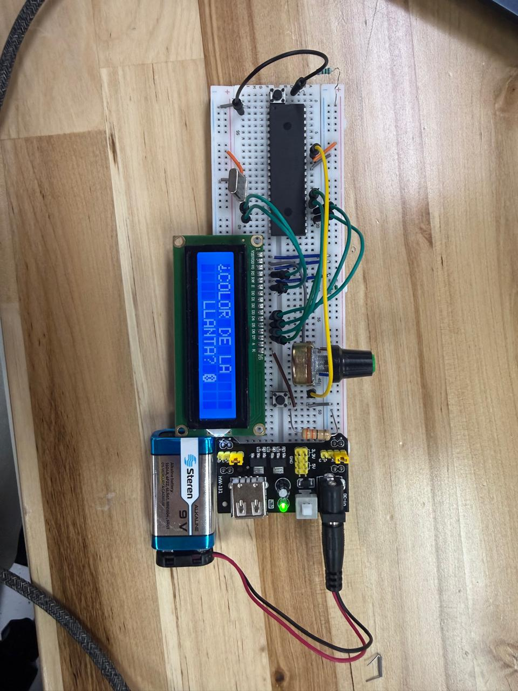
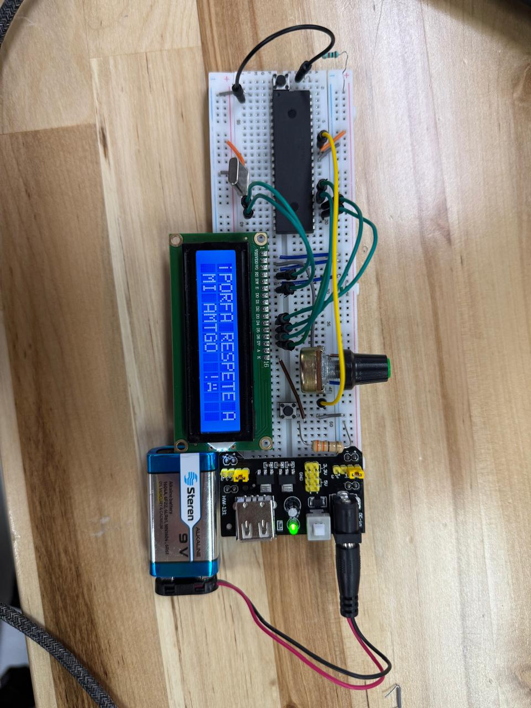

# Práctica 06 - LCD 16x2 con Caracteres Personalizados

Proyecto desarrollado con el microcontrolador **PIC16F887**, utilizando **MPLAB X IDE**, compilador **XC8** y simulación en **Proteus**.

## Descripción General

Este proyecto implementa el control de una pantalla **LCD 16x2** mediante el microcontrolador **PIC16F887**. La práctica se enfocó en el despliegue de mensajes en pantalla, el uso de caracteres dinámicos y la creación de símbolos personalizados desde código.

Además del manejo básico de texto, se modificó la librería LCD para permitir la carga de caracteres especiales en la memoria CGRAM de la pantalla. Con esto fue posible diseñar símbolos propios, como una llanta, una cara enojada y signos de apertura personalizados.

## Objetivo

Desarrollar una interfaz visual básica utilizando una LCD 16x2, integrando mensajes personalizados, cambio de contenido mediante botón y caracteres especiales creados desde software.

El objetivo principal fue comprender cómo el microcontrolador puede comunicarse con una pantalla LCD y extender su funcionamiento mediante una librería adaptada a las necesidades del proyecto.

## Componentes Utilizados

- PIC16F887
- Pantalla LCD 16x2
- Push button
- Resistencias
- Cristal de cuarzo
- MPLAB X IDE
- XC8 Compiler
- Proteus Design Suite
- Lenguaje C
- Librería LCD modificada

## Desarrollo del Proyecto

La primera parte consistió en inicializar la pantalla LCD y mostrar un mensaje principal junto con una secuencia de letras generada desde el programa. Esto permitió validar la comunicación entre el PIC16F887 y la LCD mediante el puerto configurado.

Posteriormente, se desarrolló una versión más completa en la que se agregaron caracteres personalizados. Para lograrlo, se modificó la librería `lcd.h` con una función capaz de cargar patrones en la memoria CGRAM de la LCD.

Con esta modificación fue posible crear símbolos propios mediante arreglos de 8 filas, donde cada fila representa el patrón visual del carácter dentro de una celda de 5x8 píxeles.

## Funcionamiento

El sistema utiliza la pantalla LCD en modo de 4 bits, conectando las líneas de control y datos al **PORTC** del PIC16F887.

El programa carga los caracteres personalizados al iniciar la ejecución. Después muestra un mensaje inicial en la LCD. Mediante un botón conectado a `RB0`, el usuario puede alternar entre dos mensajes diferentes.

Los mensajes implementados incluyen símbolos especiales como:

- Llanta personalizada
- Cara enojada
- Signo de interrogación invertido
- Signo de exclamación invertido

Cada vez que se presiona el botón, el programa detecta el cambio de estado y actualiza el contenido de la pantalla.

## Caracteres Personalizados

La LCD 16x2 permite almacenar caracteres definidos por el usuario dentro de su memoria CGRAM. En este proyecto se aprovecharon estas posiciones para crear símbolos propios.

Los caracteres personalizados fueron representados mediante arreglos binarios, donde cada valor define qué píxeles se encienden dentro del carácter.

Esta modificación permitió que la pantalla no solo mostrara texto estándar, sino también elementos visuales diseñados específicamente para la aplicación.

## Conceptos Aplicados

- Manejo de LCD 16x2
- Comunicación en modo de 4 bits
- Modificación de librería LCD
- Creación de caracteres personalizados
- Uso de memoria CGRAM
- Lectura de botón digital
- Cambio de mensajes en pantalla
- Configuración de puertos digitales
- Simulación en Proteus

## Resultado Esperado

Al ejecutar el proyecto, la LCD debe mostrar mensajes correctamente en sus dos líneas disponibles.

En la versión con botón, cada pulsación debe alternar entre los dos mensajes programados. Los caracteres personalizados deben visualizarse dentro del texto, demostrando que la librería LCD fue adaptada correctamente para cargar símbolos creados desde código.

## Evidencias

### Circuito en Proteus

### Mensaje en LCD

### Segundo mensaje con carácter personalizado

## Archivos

| Archivo | Descripción |
|---|---|
| `description.txt` | Descripción corta para la tabla principal |
| `Practica_6.X.production.hex` | Archivo compilado de la práctica principal |
| `Actividad_6.X.production.hex` | Archivo compilado de la actividad con caracteres personalizados |
| `Micro_practica6.pdsprj` | Proyecto de simulación en Proteus |
| `Circuito proteus practica 6.png` | Evidencia del circuito en Proteus |
| `practica6.jpeg` | Evidencia del primer mensaje en LCD |
| `mensaje2_practica6.jpeg` | Evidencia del segundo mensaje en LCD |
| `README.md` | Documentación del proyecto |

## Estado

Proyecto simulado en Proteus, con despliegue de mensajes en LCD 16x2 y uso de caracteres personalizados mediante librería LCD modificada.
