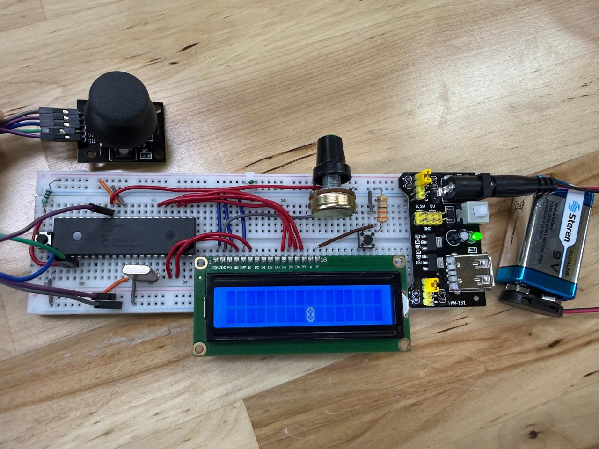

# Proyecto 01 - Videojuego LCD con Joystick Analógico

Proyecto embebido desarrollado con el microcontrolador **PIC16F887**, utilizando **MPLAB X IDE**, compilador **XC8** y simulación en **Proteus**.

## Descripción General

Este proyecto implementa un videojuego básico sobre una pantalla **LCD 16x2**, utilizando el microcontrolador **PIC16F887** como unidad principal de control. El sistema emplea dos potenciómetros como un joystick analógico simulado, permitiendo mover un objeto dentro de la pantalla mediante la lectura de dos señales analógicas.

El objeto principal del juego se representa mediante caracteres personalizados cargados en la memoria CGRAM de la LCD. Se diseñaron dos estados visuales: una llanta normal y una llanta ponchada, los cuales pueden alternarse mediante un botón digital.

Este proyecto integra adquisición analógica, control de interfaz visual, lectura de entradas digitales y generación de gráficos simples en una LCD alfanumérica.

## Objetivo del Proyecto

Desarrollar una aplicación interactiva en un sistema embebido utilizando el PIC16F887, donde el usuario pueda controlar un objeto en pantalla mediante entradas analógicas.

El propósito principal fue combinar el módulo ADC, una pantalla LCD 16x2, botones digitales y caracteres personalizados para construir una interfaz tipo videojuego dentro de las limitaciones de hardware del microcontrolador.

## Componentes Utilizados

- PIC16F887
- Pantalla LCD 16x2
- Dos potenciómetros
- Push button
- Resistencias
- Cristal de cuarzo
- MPLAB X IDE
- XC8 Compiler
- Proteus Design Suite
- Lenguaje C
- Librería LCD modificada

## Descripción del Funcionamiento

El sistema utiliza dos potenciómetros conectados a los canales analógicos del PIC16F887. Cada potenciómetro funciona como un eje del joystick:

- Un potenciómetro controla el movimiento horizontal.
- El otro potenciómetro controla la posición vertical.

El microcontrolador lee ambos valores mediante el módulo ADC. A partir de esas lecturas, el programa determina si el objeto debe desplazarse hacia la izquierda, derecha, línea superior o línea inferior de la LCD.

La posición horizontal se limita al rango disponible de la pantalla LCD, es decir, 16 columnas. La posición vertical se ajusta a las dos filas disponibles de la pantalla.

Además, el proyecto incorpora un botón conectado a `RB0`. Al presionarlo, el sistema alterna el estado visual del objeto entre una llanta normal y una llanta ponchada.

## Desarrollo Técnico

### Lectura del joystick analógico

Los dos potenciómetros generan señales analógicas variables. Estas señales se leen mediante el ADC de 10 bits del PIC16F887, obteniendo valores entre `0` y `1023`.

El programa compara las lecturas con una zona central de referencia. Si el valor supera cierto umbral, la posición del objeto cambia. Esto permite simular el comportamiento de un joystick sin utilizar un módulo físico especializado.

### Movimiento en LCD 16x2

La LCD se utiliza como área de juego. El programa limpia la pantalla, calcula la nueva posición y coloca el carácter personalizado en la fila y columna correspondiente.

La posición horizontal se actualiza dentro del rango de columnas de la LCD, mientras que la posición vertical se limita a las dos filas disponibles.

### Caracteres personalizados

La librería LCD fue adaptada para cargar caracteres personalizados en la memoria CGRAM. Esto permitió representar elementos gráficos propios dentro de la LCD.

Se crearon dos caracteres principales:

| Carácter | Uso |
|---|---|
| Llanta | Estado normal del objeto |
| Llanta ponchada | Estado alternativo activado con botón |

## Conceptos Aplicados

- Lectura de entradas analógicas
- Uso del módulo ADC del PIC16F887
- Simulación de joystick con potenciómetros
- Control de pantalla LCD 16x2
- Creación de caracteres personalizados
- Uso de memoria CGRAM
- Lectura de botón digital
- Control de posición en pantalla
- Desarrollo de interfaz interactiva en sistema embebido

## Resultado Esperado

Al ejecutar el proyecto, la LCD debe mostrar una llanta dentro de la pantalla. Al mover los potenciómetros, la posición del objeto debe cambiar de acuerdo con la dirección simulada por el joystick.

Al presionar el botón, el objeto cambia visualmente entre la llanta normal y la llanta ponchada, mostrando una interacción adicional dentro del videojuego.

## Evidencias

### Circuito en Proteus

### Evidencia del funcionamiento

### Video de funcionamiento

[Ver video de funcionamiento](./Video%20funcionamiento%20proyecto%201.mp4)

<video src="./Video%20funcionamiento%20proyecto%201.mp4" controls width="550"></video>

## Archivos

| Archivo | Descripción |
|---|---|
| `description.txt` | Descripción breve del proyecto para la tabla principal |
| `Proyecto_1.X.production.hex` | Archivo compilado para simulación |
| `Micro_Project1.pdsprj` | Proyecto de simulación en Proteus |
| `Circuito proteus proyecto 1.png` | Evidencia visual del circuito en Proteus |
| `Evidencia_proyecto1.jpeg` | Evidencia visual del videojuego en ejecución |
| `Video funcionamiento proyecto 1.mp4` | Video de funcionamiento del proyecto |
| `README.md` | Documentación técnica del proyecto |

## Estado del Proyecto

Proyecto simulado en Proteus, integrando lectura ADC de dos canales, control de posición en LCD 16x2, caracteres personalizados y entrada digital para cambio de estado visual.
